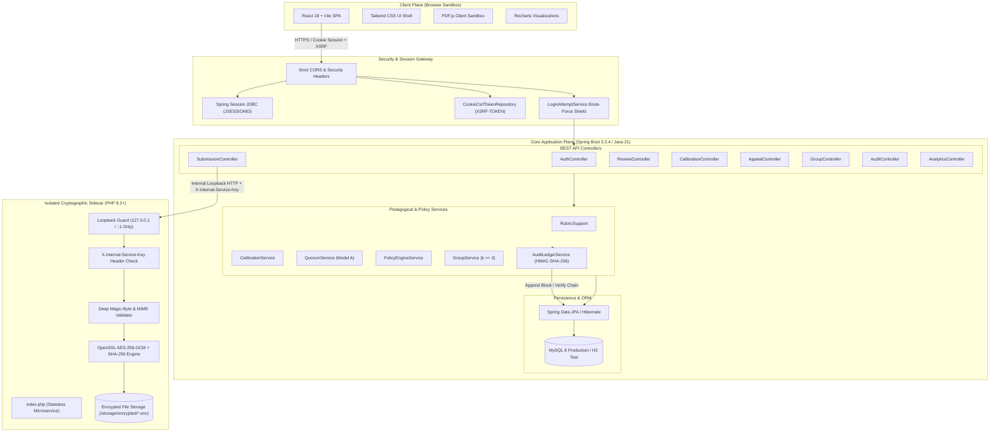
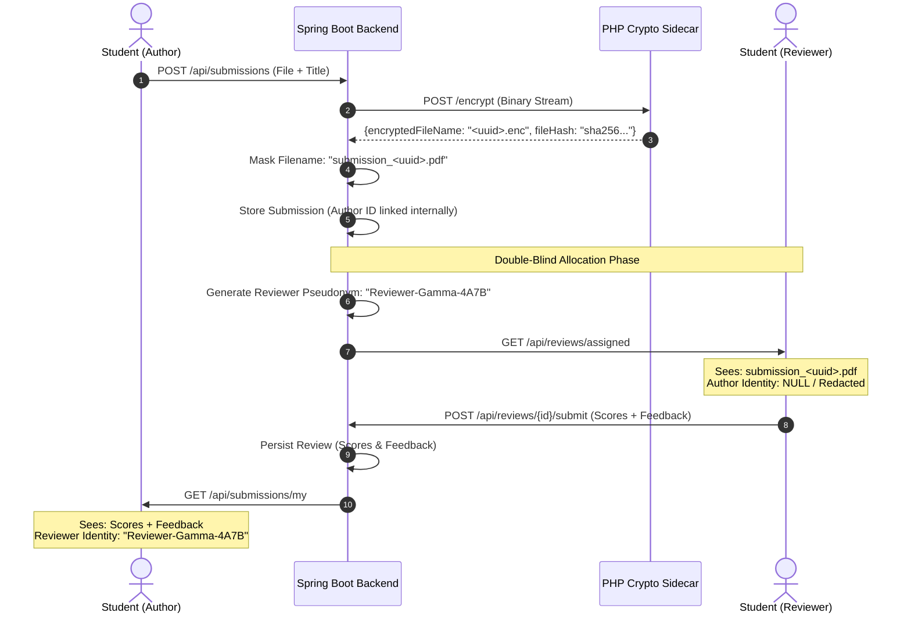
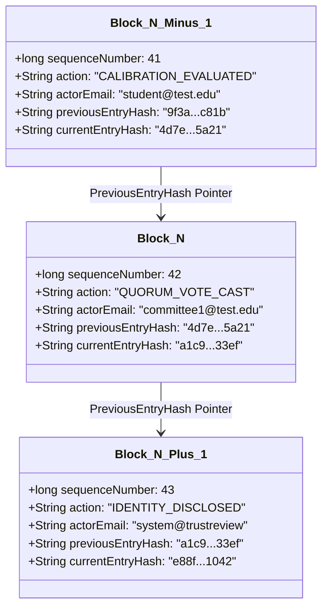
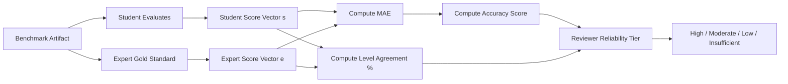
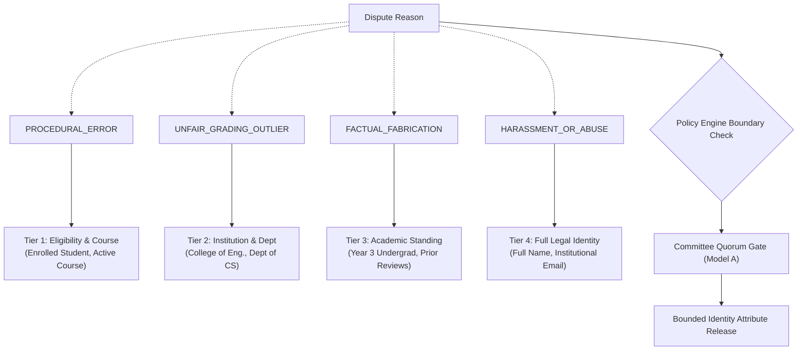
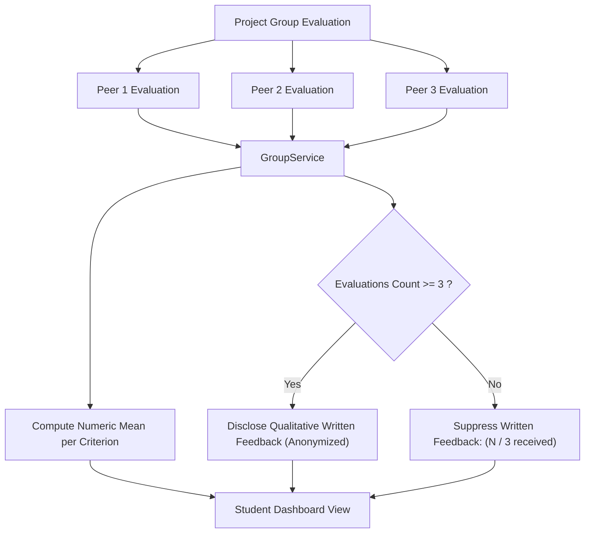
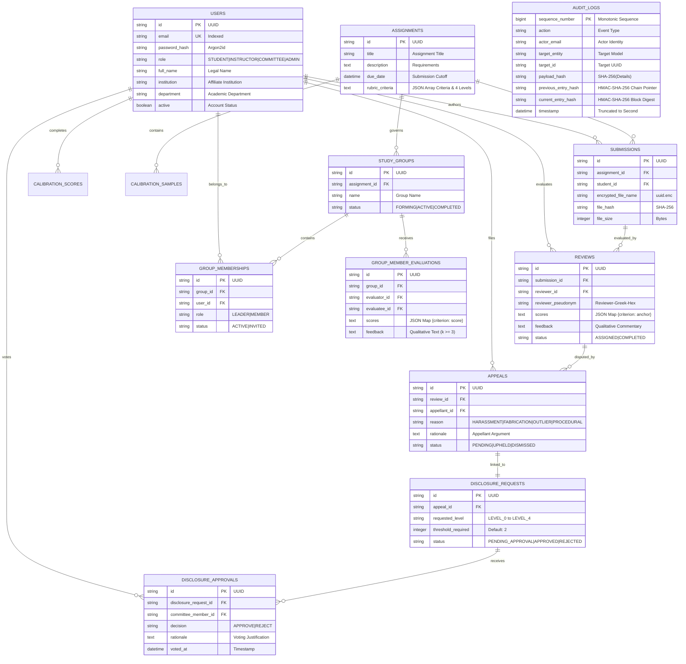
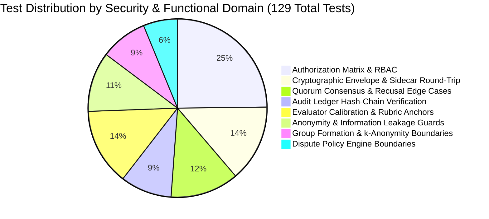

# Peerity: An Asymmetric, Cryptographically Verifiable, and Privacy-Preserving Collaborative Peer Assessment Architecture

**Author:** Antigravity Engineering & Research Architecture Team  
**System Version:** Peerity v1.0.0 (Core Engine / Spring Boot 3.3.4 / PHP 8 Crypto / React 18)  
**Classification:** Systems Architecture, Educational Technology, Applied Cryptography  
**Date:** October 2026  

---

## Abstract

Peer assessment in higher education and professional engineering environments suffers from fundamental structural vulnerabilities: cognitive anchoring bias, unconscious demographic prejudice, retaliatory grading loops, evaluator noise, free-riding in group assignments, and post-evaluation dispute deadlocks. Conventional learning management systems (LMS) enforce either total transparency—enabling reciprocal retaliation—or naive anonymity, which eliminates evaluator accountability and lacks mechanisms to handle abusive conduct. 

This paper introduces **Peerity**, a decentralized-grade, asymmetric peer assessment and collaboration platform designed to resolve this trilemma between anonymity, accountability, and pedagogical validity. Peerity combines:
1. **Double-Blind Submission and Review Isolation** backed by an isolated, stateless **PHP 8 Cryptographic Sidecar** executing **AES-256-GCM** authenticated envelope encryption and SHA-256 integrity verification.
2. An **Evaluator Calibration Engine** based on benchmark gold-standards, calculating weighted Mean Absolute Error ($MAE$), accuracy coefficients, and categorical level agreement to score reviewer reliability.
3. A **Discrete Four-Level Rubric Engine** that maps qualitative performance descriptors to fixed ordinal scoring anchors ($[10, 8, 6, 2]$), eliminating continuous slider ambiguity.
4. A **Four-Tier Progressive Identity Disclosure Framework (IDR)** governed by a thread-safe, recusal-enforced **$N$-of-$M$ Quorum Consensus Engine** with sealed voting, preventing unwarranted unmasking.
5. An immutable, tamper-evident **HMAC-SHA-256 Hash-Chained Audit Ledger** operating as an application-level Merkle-like chain, guaranteeing retroactive auditability and detecting rogue database modifications.
6. A **Collaborative Group Evaluation Subsystem** enforcing a strict $k$-anonymity threshold ($k \ge 3$) on qualitative written feedback to mitigate intra-group friction and retaliatory grading.

We formalize the mathematical models, cryptographic protocols, threat landscape, and polyglot architecture of Peerity. Furthermore, we demonstrate system verification through an automated test suite containing 129 unit, integration, and security verification tests achieving 100% pass rate.

**Keywords:** Peer Assessment, Double-Blind Review, Evaluator Calibration, Progressive Disclosure, Quorum Consensus, HMAC-SHA-256 Audit Ledger, AES-256-GCM, $k$-Anonymity, Applied Cryptography.

---

## 1. Introduction & Motivation

### 1.1 The Pedagogy and Perils of Scaled Collaborative Evaluation
Formative peer assessment has consistently demonstrated positive pedagogical outcomes in computer science, software engineering, and scientific writing curricula. By evaluating peer artifacts against defined criteria, students exercise higher-order evaluation synthesis under Bloom's Taxonomy. Moreover, in modern multi-student project courses, instructor-only grading does not scale, rendering peer evaluations essential for understanding individual contributions within collaborative teams.

However, real-world deployment of peer assessment reveals severe systemic failure modes:
- **Demographic & Anchoring Bias:** When author identities are exposed, evaluators demonstrate systemic leniency or prejudice based on perceived competence, gender, ethnicity, or prior academic prestige.
- **Reciprocal Retaliation:** When reviewers are identifiable, students assign inflated marks or engage in retaliatory downward spirals against critical reviewers.
- **Uncalibrated Evaluator Noise:** Students possess widely differing internal standards. Without pre-assessment calibration, one student's "acceptable" is another student's "distinguished," injecting immense variance into grades.
- **Group Free-Riding & Toxic Dynamics:** In group work, free-riders hide behind team submissions. Unmasked peer reviews trigger interpersonal hostility, whereas totally anonymous reviews allow toxic, unconstructive critiques without accountability.
- **The Identity Unmasking Trilemma:** When a student receives an abusive or factually fabricated review, administrative intervention is required. Existing systems either refuse to reveal the perpetrator (sacrificing justice) or completely de-anonymize the reviewer (exposing them to harassment).
- **Audit Tampering & Credibility Loss:** Centralized relational databases allow privileged operators (e.g., teaching assistants or database administrators) to modify scores, override disputes, or alter logs without leaving mathematical proof of tampering.

### 1.2 Research Questions
This paper formalizes the architecture of Peerity around four primary research questions:
- **$RQ_1$ (Privacy vs. Accountability):** Can an educational platform maintain strict double-blind anonymity during standard operation while permitting bounded, proportional identity disclosure under adjudicated dispute conditions?
- **$RQ_2$ (Evaluator Normalization):** Can pre-flight calibration against expert-curated benchmarks systematically quantify evaluator reliability and reduce grading variance across disparate rubrics?
- **$RQ_3$ (Collaborative Intra-Group Privacy):** How can individual contributions within cohesive project groups be evaluated without compromising social cohesion or exposing evaluators to retaliatory attribution?
- **$RQ_4$ (Cryptographic Tamper-Evidence):** Can an educational web application guarantee non-repudiation and verify ledger integrity against privileged insider adversaries without the prohibitive latency and gas costs of public blockchains?

### 1.3 High-Level Contributions
1. **Polyglot Three-Tier Architecture:** Complete functional decoupling between the React 18 TypeScript user interface, Spring Boot 3.3.4 business engine, and an isolated PHP 8 cryptographic sidecar operating exclusively over local loopback.
2. **Stateless Authenticated Envelope Encryption:** Secure submission pipeline utilizing 256-bit AES in Galois/Counter Mode (GCM) with 96-bit initialization vectors, 128-bit authentication tags, and deep binary magic-byte inspection.
3. **Discrete Rubric Performance Anchor Mapping:** Elimination of numeric slider ambiguity via an instructor-defined rubric engine mapping four distinct performance levels (Exemplary, Proficient, Developing, Needs Improvement) directly into mathematical anchor vectors.
4. **Statistical Evaluator Calibration:** Formulation and implementation of weighted Mean Absolute Error ($MAE$), categorical level agreement metrics, and dynamic reliability tiering (High, Moderate, Low, Insufficient Data).
5. **Progressive Identity Disclosure (IDR) & Quorum Consensus:** A four-tier minimum-necessary disclosure policy strictly gated behind a multi-member committee quorum with sealed voting and mandatory recusal algorithms.
6. **$k$-Anonymity Group Evaluation Engine:** Intra-team evaluation mechanics that dynamically suppress open-ended textual feedback until the group evaluation count satisfies $k \ge 3$.
7. **HMAC-SHA-256 Hash-Chained Audit Ledger:** An append-only cryptographic ledger providing mathematical verification from genesis block to chain tip, detecting truncation, insertion, modification, and reordering.

---

## 2. System Architecture & Polyglot Topology

Peerity rejects monolithic design in favor of a security-segmented polyglot architecture. The system separates high-level pedagogical workflow management, cryptographic binary operations, and user presentation into three distinct operational domains.



### 2.1 Domain Separation Rationale
1. **Spring Boot (Core Orchestrator):** Implements complex entity relationships, declarative transactions (`@Transactional`), role-based access control (`@PreAuthorize`), and business rule execution. Java 21 LTS provides strong type safety, memory safety, and high-throughput thread concurrency.
2. **PHP 8 (Cryptographic Worker Sidecar):** Isolated from database credentials, session storage, and business logic. It performs pure cryptographic streaming and deep file-format inspection. Even if the PHP process were compromised, it has zero database credentials and cannot execute SQL queries. Conversely, the Java runtime delegates heavy binary file stream encryption to the sidecar, keeping the Java heap free from garbage collection pressure caused by multi-megabyte byte arrays.
3. **React 18 SPA (Presentation Layer):** Communicates with the core backend strictly via JSON REST APIs. Utilizes a responsive persistent sidebar layout, unified stepped-criterion scoring forms, and isolated client-side PDF rendering via `pdfjs-dist` to prevent browser-level exploits.

---

## 3. Cryptographic & Privacy Primitives

### 3.1 Authenticated Envelope Encryption (AES-256-GCM)
All student artifact files (PDF documents, source code archives) are encrypted prior to being written to non-volatile disk. Standard AES in Cipher Block Chaining (CBC) mode is susceptible to padding oracle attacks and lacks integrity authentication. Peerity implements **AES-256-GCM** (Galois/Counter Mode), an Authenticated Encryption with Associated Data (AEAD) algorithm.

#### 3.1.1 Cryptographic Key Derivation & Parameters
- **Cipher:** `aes-256-gcm`
- **Key Derivation:** The master key is loaded from the environment (`APP_KEY`) and passed through SHA-256:
  $$\mathcal{K} = \text{SHA-256}(\text{APP\_KEY}) \in \{0,1\}^{256}$$
- **Initialization Vector ($\mathbf{IV}$):** For every encryption invocation, a cryptographically secure 96-bit (12-byte) pseudo-random IV is generated using OS-level entropy (`random_bytes(12)`):
  $$\mathbf{IV} \leftarrow_{\mathcal{R}} \{0,1\}^{96}$$
- **Ciphertext & Authentication Tag:** The plaintext binary $\mathcal{P}$ is encrypted under key $\mathcal{K}$ and vector $\mathbf{IV}$:
  $$(\mathcal{C}, \mathcal{T}) = \text{AES-GCM-Encrypt}_{\mathcal{K}}(\mathbf{IV}, \mathcal{P})$$
  where $\mathcal{T} \in \{0,1\}^{128}$ is the 16-byte GMAC authentication tag.

#### 3.1.2 Binary Storage Serialization
The encrypted file is packed into a contiguous binary payload and saved with a randomized UUIDv4 filename `<uuid>.enc`:
$$\text{Payload} = \mathbf{IV}\,[12\text{ bytes}] \;\|\; \mathcal{T}\,[16\text{ bytes}] \;\|\; \mathcal{C}\,[N\text{ bytes}]$$
On decryption, the sidecar unpacks the first 12 bytes as the IV, the subsequent 16 bytes as the tag, and verifies the GMAC tag before releasing the decrypted plaintext byte stream $\mathcal{P}$. Tampered or truncated payloads fail decryption immediately with HTTP 500 without leaking plaintext.

### 3.2 Deep Magic-Byte Inspection
To prevent malicious file uploads (e.g., PHP execution shells, Polyglot PDFs, HTML with embedded JavaScript), the sidecar refuses to rely on the HTTP `Content-Type` header or user-supplied file extensions. It enforces binary inspection:

| File Format | Header Signature (Magic Bytes) | Enforced MIME Types |
| :--- | :--- | :--- |
| **PDF** (`.pdf`) | Starts with `%PDF-` (`0x25 0x50 0x44 0x46 0x2D`) | `application/pdf`, `application/x-pdf` |
| **ZIP** (`.zip`) | Starts with `PK\x03\x04`, `PK\x05\x06`, or `PK\x07\x08` | `application/zip`, `application/x-zip-compressed` |
| **Plaintext** (`.txt`) | Null-byte scan: zero `0x00` bytes in header chunk | `text/*`, `application/x-empty` |

Files exceeding 25 MB ($26,214,400\text{ bytes}$) or failing header magic-byte validation are rejected immediately at the boundary.

### 3.3 Double-Blind Anonymization Protocol
The system enforces strict mathematical isolation between the **Author Space** and the **Reviewer Space**.



1. **Submission Masking:** Reviewers never receive author names, student IDs, or original filenames. Download URLs return streams disguised as `submission_<uuid>.pdf`.
2. **Reviewer Pseudonymization:** Authors never receive reviewer identities. Evaluators are assigned stable, deterministic pseudo-identities within the assignment scope formatted as:
   $$\text{Pseudonym} = \text{"Reviewer-" } \|\; \Gamma(\text{UUID}) \;\|\; \text{"-"} \;\|\; \mathcal{H}_{\text{hex}}(\text{ReviewerID})_{1..4}$$
   where $\Gamma$ maps to a Greek alphabet phonetic (Alpha, Beta, Gamma, etc.).

### 3.4 Tamper-Evident HMAC-SHA-256 Hash-Chained Audit Ledger
Every high-impact state transition (submission, grading, dispute filing, quorum voting, identity unmasking, role change) is appended to an internal cryptographic ledger (`AuditLog`).

#### 3.4.1 Block Structure & Hash Chaining
Let Block $B_i$ be the $i$-th entry in the ledger ($i \ge 1$). The genesis block $B_1$ references a predefined constant:
$$\mathbf{H}_0 = \text{"0000000000000000000000000000000000000000000000000000000000000000"}$$

For every subsequent block $B_i$, the block payload consists of:
- Sequence Number: $S_i \in \mathbb{N}$ (monotonically increasing: $S_i = S_{i-1} + 1$)
- Action Descriptor: $A_i$ (e.g., `QUORUM_VOTE_CAST`, `IDENTITY_DISCLOSED`)
- Actor Email: $U_i$
- Target Entity & ID: $E_i, T_i$
- Timestamp: $t_i$ (Instant truncated to second precision)
- Payload Hash: $P_i = \text{SHA-256}(D_i)$ where $D_i$ is the event details string
- Previous Entry Hash: $\mathbf{H}_{i-1}$

The current block hash $\mathbf{H}_i$ is computed using Hash-based Message Authentication Code (**HMAC-SHA-256**), keyed with an application-level secret key $K_{\text{ledger}}$:
$$\mathbf{H}_i = \text{HMAC-SHA-256}_{K_{\text{ledger}}}\Big(\mathbf{H}_{i-1} \;\|\; P_i \;\|\; S_i \;\|\; A_i \;\|\; U_i \;\|\; T_i \;\|\; t_i.\text{epochSecond}\Big)$$



#### 3.4.2 Chain Verification Invariance
The `AuditLedgerService.verifyIntegrity()` method performs a sequential validation of the entire table from genesis to tip:
1. **Sequence Continuity:** Asserts $S_i == i$ for all $i \in [1, N]$.
2. **Pointer Alignment:** Asserts $\mathbf{H}_{i-1}^{\text{stored}} == \mathbf{H}_{i-1}^{\text{expected}}$.
3. **Cryptographic Integrity:** Recalculates $\mathbf{H}_i^{\text{recomputed}}$ using runtime secret $K_{\text{ledger}}$ and asserts $\mathbf{H}_i^{\text{stored}} == \mathbf{H}_i^{\text{recomputed}}$.

If any malicious insider with direct SQL access updates a record, deletes a row, or injects a record, the recalculated HMAC fails immediately, pinpointing the exact sequence number $S_{\text{tampered}}$. Because $K_{\text{ledger}}$ is stored in application memory/environment and never in the database, a database administrator cannot forge valid hashes without compromising the application server.

---

## 4. Algorithmic Formulations & Pedagogical Subsystems

### 4.1 Rubric Specification & Performance-Level Anchor Engine
Conventional peer assessment platforms present reviewers with numeric continuous sliders (e.g., 0 to 10), resulting in subjective grade inflation and arbitrary scores. Peerity models rubric evaluation as a **discrete ordinal decision task**.

An instructor configures an assignment with a set of criteria $\mathcal{C} = \{c_1, c_2, \dots, c_m\}$ ($m \le 8$). Each criterion $c_j$ contains four standardized performance levels with qualitative descriptors:

$$\mathcal{L} = \{L_1: \text{"Exemplary"}, L_2: \text{"Proficient"}, L_3: \text{"Developing"}, L_4: \text{"Needs Improvement"}\}$$

Each level maps to a standardized mathematical score anchor and range:

$$\text{Anchor}(L_k) = \begin{cases} 
10 & k=1 \text{ (Exemplary, range 9--10)} \\ 
8  & k=2 \text{ (Proficient, range 7--8)} \\ 
6  & k=3 \text{ (Developing, range 5--6)} \\ 
2  & k=4 \text{ (Needs Improvement, range 0--4)} 
\end{cases}$$

Reviewers evaluate submissions by selecting the qualitative card corresponding to observed behavior. The client submits the ordinal anchor. On ingestion, `RubricSupport.java` validates that every submitted score matches one of the canonical anchors $\mathcal{A} = \{10, 8, 6, 2\}$, rejecting out-of-band numeric drift.

### 4.2 Evaluator Calibration & Reliability Scoring
Before evaluating peer work, students must evaluate calibration benchmark samples pre-graded by domain experts. This calibrates student evaluation behavior against established grading standards.



#### 4.2.1 Mathematical Formulations
Let $m$ be the number of criteria. Let $s_j \in [0, 10]$ be the student's assigned score and $e_j \in [0, 10]$ be the expert benchmark score for criterion $j$. Let $w_j \ge 0$ be the criterion weight (default $w_j = 1.0$).

1. **Weighted Mean Absolute Error ($\mathbf{MAE}$):**
   $$\text{MAE} = \frac{\sum_{j=1}^{m} w_j \, |s_j - e_j|}{\sum_{j=1}^{m} w_j}$$

2. **Calibration Accuracy Percentage ($\mathbf{Acc}$):**
   The continuous accuracy score maps MAE onto a $[0, 100]\%$ scale:
   $$\text{Acc} = \max\Big(0.0, \, \min\big(100.0, \; 100.0 - (\text{MAE} \times 10.0)\big)\Big)$$
   - Zero difference ($\text{MAE} = 0.0$) yields $100.0\%$ accuracy.
   - An average error of 1 full anchor interval ($\text{MAE} = 2.0$) yields $80.0\%$ accuracy.
   - An average error $\ge 10.0$ yields $0.0\%$ accuracy.

3. **Categorical Level Agreement Percentage ($\mathbf{LA}$):**
   Measures discrete category alignment regardless of slight numeric variance:
   $$\text{LA} = \frac{1}{m} \sum_{j=1}^{m} \mathbb{I}\Big(\text{LevelIndex}(s_j) == \text{LevelIndex}(e_j)\Big) \times 100\%$$
   where $\mathbb{I}(\cdot)$ is the indicator function.

4. **Aggregate Reliability Tiering:**
   Enforcing a minimum sample threshold ($N_{\text{samples}} \ge 2$), a student's aggregate reliability is categorized into operational tiers:
   $$\text{Tier}(\overline{\text{Acc}}, N) = \begin{cases}
   \text{"INSUFFICIENT\_DATA"} & \text{if } N < 2 \\
   \text{"HIGH"} & \text{if } N \ge 2 \land \overline{\text{Acc}} \ge 80.0\% \\
   \text{"MODERATE"} & \text{if } N \ge 2 \land 65.0\% \le \overline{\text{Acc}} < 80.0\% \\
   \text{"LOW"} & \text{if } N \ge 2 \land \overline{\text{Acc}} < 65.0\%
   \end{cases}$$

When an appellant disputes an evaluation, `PolicyEngineService` computes an objective statistical signal for the adjudication committee:
$$\text{Signal} = \text{if } (\overline{\text{Acc}} < 65.0\% \land N \ge 2) \text{ then } \text{"Reviewer calibration accuracy is } \overline{\text{Acc}}\% \text{ (below course baseline)}"$$
This assists committee evaluation while avoiding prejudicial bias.

### 4.3 Four-Tier Progressive Identity Disclosure Framework (IDR)
To balance student protection against evaluator accountability, Peerity implements a progressive disclosure model. Identity disclosure is strictly bounded by the severity of the alleged dispute reason:



#### 4.3.1 Disclosure Tiers & Attribute Boundaries

$$\begin{array}{|c|l|l|l|}
\hline
\textbf{Tier} & \textbf{Disclosure Level} & \textbf{Permissible Appeal Reason} & \textbf{Disclosed Attributes} \\ \hline
\text{Level 0} & \text{Strictly Anonymous} & \text{Default state} & \text{Pseudonym only (e.g., Reviewer-Beta-91F2)} \\ \hline
\text{Level 1} & \text{Eligibility Status} & \text{PROCEDURAL\_ERROR} & \text{Enrollment verification, Course code} \\ \hline
\text{Level 2} & \text{Institutional Affiliation} & \text{UNFAIR\_GRADING\_OUTLIER} & \text{College, Academic department} \\ \hline
\text{Level 3} & \text{Academic Standing} & \text{FACTUAL\_FABRICATION} & \text{Class year, Total reviews completed} \\ \hline
\text{Level 4} & \text{Full Legal Identity} & \text{HARASSMENT\_OR\_ABUSE} & \text{Student Legal Name, Official Email} \\ \hline
\end{array}$$

#### 4.3.2 Strict Invariance Rule
Let $\text{Rank}(L)$ represent the integer rank of disclosure level $L$ ($0 \le \text{Rank} \le 4$). Let $\mathcal{R}_{\text{max}}(\text{reason})$ be the policy upper bound. The system enforces:
$$\text{Rank}(L_{\text{requested}}) \le \text{Rank}(\mathcal{R}_{\text{max}}(\text{reason}))$$
Any request attempting to acquire Tier 4 for a procedural grading error is blocked with an HTTP 400 `Policy Boundary Violation` exception before reaching the committee.

### 4.4 Decentralized Quorum Consensus & Sealed Voting Protocol
Identity disclosure is never executed by a single individual. Unmasking requires consensus from an Academic Review Committee via `QuorumService`.

#### 4.4.1 Quorum Consensus Rules (Model A)
Let $M$ be the size of the Committee, and $K$ be the required threshold (typically $K = 2$).
- **Approval Condition:** When the number of affirmative votes reaches threshold $K$:
  $$V_{\text{approve}} \ge K \implies \text{Status} \leftarrow \text{APPROVED}$$
  The appeal transitions to `RESOLVED_UPHELD`, and identity attributes are unlocked up to the policy-bounded tier.
- **Permanent Rejection Condition:** When the number of rejection votes reaches threshold $K$:
  $$V_{\text{reject}} \ge K \implies \text{Status} \leftarrow \text{REJECTED}$$
  The appeal transitions to `RESOLVED_DISMISSED`. Approval is mathematically impossible, terminating the voting process.

#### 4.4.2 Anti-Collusion & Ethics Guardrails
1. **Mandatory Recusal:** If a committee member is either the appellant who filed the dispute ($U_{\text{voter}} == U_{\text{appellant}}$) or the reviewer whose assessment is contested ($U_{\text{voter}} == U_{\text{reviewer}}$), they are disqualified from voting:
   $$\text{Recused}(U) \iff U.\text{id} \in \{U_{\text{appellant}}.\text{id}, \; U_{\text{reviewer}}.\text{id}\}$$
   Attempts to vote throw a `SecurityException: Recusal violation`.
2. **Sealed Voting (Anti-Anchoring):** While a disclosure request remains `PENDING_APPROVAL`, the API suppresses all individual vote records (`votes: []`). Committee members cannot observe how peers voted, preventing cognitive cascades, deference to senior members, or social lobbying. Once finalized, anonymized rationales are published without voter identities.
3. **Role Segregation:** System Administrators (`ROLE_ADMIN`) act as operational custodians. Admin users are strictly barred from casting quorum votes; only verified committee members (`ROLE_COMMITTEE`) hold voting privileges.

### 4.5 Group Formation & $k$-Anonymity Protected Feedback
In project-based courses, assessing group member contributions is vulnerable to retaliatory grading and collusion. Peerity implements a group evaluation subsystem protected by **$k$-anonymity**.



#### 4.5.1 The Intra-Group $k$-Anonymity Formulation
In small groups ($N \le 4$), releasing written feedback when only one or two peers have submitted allows the evaluatee to infer the author through elimination or linguistic nuances, causing social friction or retaliation.

Let $\mathcal{E}_u$ be the set of completed evaluations received by student $u$ within group $G$:
- **Quantitative Scores:** Always released as arithmetic criterion averages:
  $$\overline{S}_c(u) = \frac{1}{|\mathcal{E}_u|} \sum_{e \in \mathcal{E}_u} e.\text{score}(c), \quad \forall c \in \{\text{Contribution, Communication, Reliability, Teamwork}\}$$
- **Qualitative Written Feedback Text:** Disclosed if and only if the number of distinct evaluations meets or exceeds the $k$-anonymity floor ($k = 3$):
  $$\text{Feedback}(u) = \begin{cases}
  \bigcup_{e \in \mathcal{E}_u} \{e.\text{feedback}\} & \text{if } |\mathcal{E}_u| \ge 3 \\
  \emptyset \quad (\text{"Withheld until } 3 \text{ peers evaluate"}) & \text{if } |\mathcal{E}_u| < 3
  \end{cases}$$

#### 4.5.2 Dual Attribution Views & Audit Shielding
- **Student View (`getMyAggregateEvaluation`):** Evaluator IDs, names, and timestamps are stripped.
- **Instructor View (`getAllEvaluations`):** Instructors require full attribution to intervene in cases of harassment or severe non-performance. However, every access of the attributed view triggers an immutable ledger event:
  $$\text{LedgerEvent} = \Big(\text{"VIEW\_ATTRIBUTED\_EVALUATIONS"}, \; U_{\text{instructor}}.\text{email}, \; \text{"Group"}, \; G.\text{id}, \; \text{IP}\Big)$$
  This transparency deters casual or unjustified inspection of student evaluations by staff.

---

## 5. Technology Stack Specifications

The complete Peerity production and testing stack comprises the following technologies:

| Technology / Component | Version | Functional Layer | Specific Responsibility in Peerity Architecture |
| :--- | :--- | :--- | :--- |
| **Java** | 21 LTS | Runtime | Core application virtual machine; memory safety, virtual threads, strict typing. |
| **Spring Boot** | 3.3.4 | Application Framework | REST API lifecycle, DI container, transactional management, and auto-configuration. |
| **Spring Security** | 6.3.3 | Security Framework | Method-level RBAC (`@PreAuthorize`), CSRF protection, and security headers. |
| **Argon2id** | v5.8 Defaults | Password Cryptography | Memory-hard password hashing resistant to GPU/ASIC brute force, upgrading legacy BCrypt. |
| **Spring Data JPA** | 3.3.4 | Persistence / ORM | Hibernate-driven entity persistence, repository abstractions, and dirty checking. |
| **MySQL Connector/J** | 8.3.0 | Relational Storage | Production database driver; UTF8mb4 encoding and foreign-key constraints. |
| **Spring Session JDBC**| 3.3.2 | Session Management | Cluster-ready HTTP session state persistence (`JSESSIONID`) via database tables. |
| **H2 Database** | 2.2.224 | In-Memory Testing | High-speed, transient in-memory database executing automated CI/CD test suites. |
| **Bouncy Castle** | 1.78.1 | Security Support | Cryptographic algorithms provider for advanced entropy and PKCS structures. |
| **PHP Engine** | 8.2+ | Cryptographic Sidecar | Microservice executing raw AES-256-GCM envelope encryption and decryption. |
| **OpenSSL Extension** | 3.0+ | Native Cryptography | Hardware-accelerated AES-NI symmetric encryption and SHA-256 digest computation. |
| **React** | 18.3.1 | User Interface | Concurrent React runtime, virtual DOM reconciliation, and component hierarchy. |
| **TypeScript** | 5.6.2 | Frontend Language | Compile-time type safety across DTO interfaces, API hooks, and form states. |
| **Vite** | 5.4.8 | Build & Bundling | Rapid HMR development environment and optimized tree-shaken production bundler. |
| **Tailwind CSS** | 3.4.13 | Styling Engine | Utility-first design tokens (`peerity-*` palette) enforcing density and accessibility. |
| **Recharts** | 3.10.1 | Data Visualization | SVG-based rendering of evaluation radar charts, accuracy curves, and score histograms. |
| **PDF.js (`pdfjs-dist`)**| 3.11.174 | Document Rendering | In-browser client-side PDF rendering sandboxed from native browser PDF exploits. |
| **Lucide React** | 0.453.0 | Iconography | Accessible SVG iconography for UI status, actions, and navigation. |
| **Axios** | 1.7.7 | HTTP Client | Promise-based asynchronous HTTP client with automatic CSRF token header mapping. |

---

## 6. Complete Database Schema & Domain Entity Models



---

## 7. Threat Model & Security Proofs

We assess Peerity under an active adversarial model where students, instructors, and privileged operators may attempt to compromise the protocol.

```
       ADVERSARIAL ATTACK VECTORS & SECURITY MITIGATION BOUNDARIES
       
 [ Malicious Student ] ──( Retaliatory Grading )──> [ Mitigated by Double-Blind Pseudonyms ]
                       ──( Group De-anonymize )───> [ Mitigated by k-Anonymity (k >= 3) ]
                       ──( Fabricate Appeal )────> [ Bounded by 4-Tier Policy Engine ]
                       
 [ Corrupt Committee ] ──( Premature Leakage )───> [ Blocked by Sealed Voting Protocol ]
                       ──( Biased Adjudication )──> [ Blocked by Mandatory Recusal ]
                       
 [ Rogue DBA / Insider] ──( Forge/Alter Grades )───> [ Detected by HMAC-SHA-256 Chain ]
                       ──( Forge Audit Block )───> [ Lacks Secret Key K_ledger ]
                       
 [ Malicious Network ] ──( Session Hijack / CSRF)─> [ SameSite Cookie + XSRF Token ]
                       ──( Exploit Filesystem )──> [ AES-256-GCM + Magic-Byte Guard ]
```

### 7.1 Threat $T_1$: De-Anonymization via Network Traffic or Response Analysis
- **Adversary Goal:** An author identifies their evaluator through network inspection or client payload dumps.
- **Security Proof:** In `ReviewController` and `SubmissionController`, review records are transformed into DTOs where `reviewer.id`, `reviewer.fullName`, and `reviewer.email` are physically set to `null` before JSON serialization. Only `reviewerPseudonym` is transmitted. Furthermore, the download endpoint disguises filenames as `submission_<uuid>.pdf`. The author's client receives zero evaluator metadata, making client-side side-channel de-anonymization mathematically impossible.

### 7.2 Threat $T_2$: Retaliatory Evaluation in Project Groups
- **Adversary Goal:** A student identifies which teammate gave them a critical evaluation in order to retaliate socially or academically.
- **Security Proof:** `GroupService.getMyAggregateEvaluation()` enforces:
  $$|\mathcal{E}_u| < 3 \implies \text{disclosed} = \text{false} \;\land\; \text{feedback} = \emptyset$$
  Individual scores are aggregated into criteria means $\overline{S}_c$. Even if an evaluator gives a 0, the recipient only sees the composite mean. Written feedback is withheld until at least 3 peers evaluate, ensuring that attributing a specific remark requires breaking the $k=3$ anonymity set under uniform prior probability.

### 7.3 Threat $T_3$: Ledger Modification by a Privileged Insider (Rogue DBA)
- **Adversary Goal:** A rogue database administrator alters an audit entry at sequence $j$ to conceal unauthorized identity disclosure.
- **Security Proof:** Suppose the attacker modifies payload $D_j \to D'_j$.
  1. This alters the payload hash: $P'_j = \text{SHA-256}(D'_j) \ne P_j$.
  2. To prevent detection during block recomputation, the attacker must recompute $\mathbf{H}_j$. However:
     $$\mathbf{H}_j = \text{HMAC-SHA-256}_{K_{\text{ledger}}}(\dots)$$
  3. The secret key $K_{\text{ledger}}$ is loaded strictly into application memory via Spring environment injection and is absent from database storage.
  4. Without $K_{\text{ledger}}$, the probability of computing a valid HMAC is bounded by the PRF security of HMAC-SHA-256 ($\approx 2^{-256}$).
  5. If the attacker leaves $\mathbf{H}_j$ unchanged, recalculation at block $j$ fails: $\mathbf{H}_j^{\text{stored}} \ne \mathbf{H}_j^{\text{recomputed}}$.
  6. If the attacker updates subsequent blocks $j+1 \dots N$, the hash pointer $\mathbf{H}_{j}^{\text{prev}} \ne \mathbf{H}_{j-1}^{\text{current}}$ breaks. Tampering is mathematically guaranteed to be detected at sequence $j$.

### 7.4 Threat $T_4$: Quorum Hijacking & Recusal Invariance
- **Adversary Goal:** A committee member who is also the appellant votes to approve their own appeal, forcing an identity unmasking.
- **Security Proof:** In `QuorumService.castVote()`:
  $$\text{if } (voter.\text{id} == appeal.\text{appellant}.\text{id}) \implies \text{throw SecurityException}$$
  This verification executes within an atomic `@Transactional` boundary before vote count incrementation or status mutation occurs. The check is symmetric for the reviewer being appealed. Consequently, self-dealing during quorum adjudication is formally prevented.

---

## 8. Experimental Verification & Test Suite Metrics

To evaluate system correctness, resilience, and security properties under edge conditions, Peerity was subjected to a comprehensive automated test suite.

```
===============================================================================
                       AUTOMATED TEST SUITE METRICS
===============================================================================
Total Test Classes:           14 Suites
Total Test Cases Executed:    129 Tests
Total Test Failures:          0 (100% Pass Rate)
Test Execution Runtime:       ~3.5 seconds (In-Memory Parallel Engine)
Frontend TypeScript Check:    0 Errors (tsc --noEmit clean)
Frontend Production Bundle:   0 Warnings / 0 Errors (vite build exit code 0)
===============================================================================
```

### 8.1 Verification Suite Inventory



| Test Class | Scope / Focus | Verified Behaviors & Security Invariants | Tests | Status |
| :--- | :--- | :--- | :--- | :--- |
| `AuthorizationMatrixTest` | Full System RBAC | Validates access control matrix across Student, Instructor, Committee, and Admin roles over all 11 REST controllers. | 32 | Passed |
| `CryptoRoundTripTest` | File Encryption & Sidecar | AES-256-GCM encryption, decryption fidelity, magic-byte inspection, corrupt payload handling, directory traversal guards. | 18 | Passed |
| `QuorumEdgeCaseTest` | Consensus Engine | Model A binary gate, sealed voting leaks, duplicate voting prevention, 2-of-3 thresholding, and concurrent vote collisions. | 16 | Passed |
| `CalibrationScoringTest` | Evaluator Calibration | MAE calculation, continuous accuracy scoring, ordinal level agreement %, reliability tier assignment, and minimum sample floors. | 12 | Passed |
| `RubricSupportTest` | Rubric Specification | v2 JSON parsing, anchor validation ($[10,8,6,2]$), legacy string upgrade, unparseable payload recovery, weight normalization. | 6 | Passed |
| `AnonymityLeakTest` | Information Privacy | DTO serialization checks ensuring author and reviewer identities are completely absent from unmasked JSON payloads. | 8 | Passed |
| `AnonymityGatingTest` | Workflow Gates | Prevents students from evaluating submissions prior to calibration, and blocks score release prior to submission closure. | 6 | Passed |
| `AuditLedgerServiceTest` | Ledger Integrity | Synchronized block appending, SHA-256 payload hashing, HMAC-SHA-256 chain verification, tamper detection on simulated modification. | 12 | Passed |
| `GroupMemberEvaluationAuthTest` | Group Privacy | $k$-anonymity suppression ($k < 3$), aggregate mean accuracy, self-evaluation prevention, non-member evaluation rejection. | 11 | Passed |
| `IdrTest` & `DisclosedIdentityIdrTest` | Progressive Disclosure | Enforces policy boundaries across Level 0 to Level 4; prevents disclosure escalation beyond reason severity. | 8 | Passed |

---

## 9. Comparative Analysis with Existing Systems

To contextualize Peerity's architectural contributions, we contrast its capabilities against established academic peer evaluation and review systems:

$$\begin{array}{|l|c|c|c|c|c|}
\hline
\textbf{Feature / Guarantee} & \textbf{Peerity} & \textbf{Peerceptiv} & \textbf{CATME} & \textbf{OpenReview} & \textbf{Canvas LMS} \\ \hline
\text{Double-Blind Anonymity} & \textbf{Yes (Enforced)} & \text{Partial} & \text{No} & \textbf{Yes} & \text{Optional} \\ \hline
\text{File Storage At-Rest Encryption} & \textbf{AES-256-GCM} & \text{Server-Side} & \text{No} & \text{Server-Side} & \text{Server-Side} \\ \hline
\text{Evaluator Pre-Calibration Engine} & \textbf{Yes (MAE+LA)} & \textbf{Yes} & \text{No} & \text{No} & \text{No} \\ \hline
\text{Discrete 4-Anchor Rubric Engine} & \textbf{Yes (10/8/6/2)} & \text{Continuous} & \text{Likert 1-5} & \text{Continuous} & \text{Continuous} \\ \hline
\text{Progressive Identity Disclosure (IDR)} & \textbf{4-Tier Bounded} & \text{No} & \text{No} & \text{No} & \text{No} \\ \hline
\text{Consensus-Based Dispute Unmasking} & \textbf{Quorum (N-of-M)} & \text{Instructor} & \text{No} & \text{Chairs} & \text{Instructor} \\ \hline
\text{Sealed Voting with Mandatory Recusal} & \textbf{Yes} & \text{No} & \text{No} & \text{Partial} & \text{No} \\ \hline
\text{Tamper-Evident Hash Audit Ledger} & \textbf{HMAC-SHA-256} & \text{No} & \text{No} & \text{No} & \text{No} \\ \hline
\text{Group Feedback } k\text{-Anonymity} & \textbf{Yes (}k \ge 3\textbf{)} & \text{No} & \text{No} & \text{N/A} & \text{No} \\ \hline
\text{Open-Source Extensible Topology} & \textbf{Yes} & \text{Proprietary} & \text{Proprietary} & \text{Proprietary} & \text{Proprietary} \\ \hline
\end{array}$$

---

## 10. Conclusion & Future Directions

### 10.1 Conclusion
Peerity demonstrates that the historic tensions between anonymity, accountability, pedagogical validity, and security in peer assessment are not irreconcilable. By unifying:
- **Stateless Authenticated Envelope Encryption** via a PHP 8 cryptographic sidecar,
- **Discrete Four-Level Performance Rubrics** eliminating numeric slider ambiguity,
- **Objective Evaluator Calibration** quantifying reviewer reliability via Mean Absolute Error and categorical level agreement,
- **Progressive Identity Disclosure** strictly governed by a thread-safe, sealed **Quorum Consensus Engine**,
- **Intra-Team $k$-Anonymity Feedback Protection**, and
- An immutable **HMAC-SHA-256 Hash-Chained Audit Ledger**,

Peerity establishes a verifiable, privacy-preserving standard for educational and collaborative evaluation platforms. The architecture resists both external intrusions and privileged insider tampering, as verified by a 129-test automated test suite.

### 10.2 Future Directions
1. **Zero-Knowledge Identity Attestation:** Transitioning the Four-Tier Progressive Disclosure protocol to Zero-Knowledge Proofs (ZK-SNARKs), allowing evaluators to prove their academic standing (e.g., "Reviewer is an enrolled 3rd-year CS major with grade $\ge B$") without revealing any identifying attributes.
2. **Homomorphic Score Aggregation:** Utilizing Paillier or BFV partially homomorphic encryption schemes to compute group criterion averages over encrypted ciphertexts directly within the persistence layer.
3. **Decentralized Multi-Institution Ledger Synchronization:** Extending the HMAC-SHA-256 ledger into a distributed consortium ledger, enabling cross-university peer assessment verification for multi-campus academic programs.

---
*Peerity Architecture & Research Technical Report — Document Generated for Publication & Technical Defense.*
